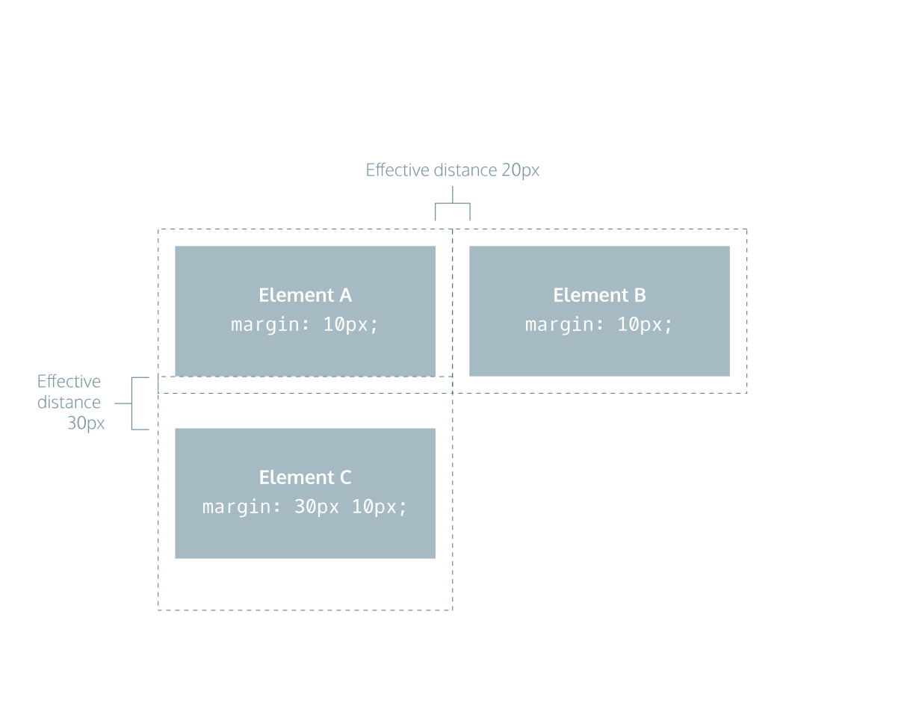

# The Box Model

[CC Box Model cheatsheet](https://www.codecademy.com/resources/docs/css/box-model)

The CSS box model is a fundamental concept in web design that describes how HTML elements are structured and displayed in a browser. It consists of four areas: content, padding, border, and margin, which together define the size and spacing of elements on a webpage.

## CSS properties of note:
- width of content area
- height of content
- padding: space between content and border
- border: thickness and style of border
- margin: space between border and outside edge of element
- overflow

### Height and Width

By default set to hold raw contents of box

    p {
    height: 80px;
    width: 240px;
    }

### Borders

[CC Borders Cheatsheet](https://www.codecademy.com/resources/docs/css/borders)

Properties:
- width
    - thin
    - medium
    - thick
- style
    - none, dotted, solid, [etc](https://developer.mozilla.org/en-US/docs/Web/CSS/border-style#values)
- color
  - see [css-colors.md](./css-colors.md)
  
#### Border Examples:

    p {
    border: 3px solid coral;
    }

Default border style is 'medium none color' where color is current element color. If parameter not set, default value is used. ie

    p.content-header {
    height: 80px;
    width: 240px;
    border: solid coral;
    }

### Border Radius

Corners can be rounded by provided radius of a circle placed at each corner of default square box.

    div.container {
    border: 3px solid blue;
    border-radius: 5px;
    }

You can create a border that is a perfect circle by first creating an element with the same width and height, and then setting the radius equal to half the width of the box, which is 50%.

    div.container {
    height: 60px;
    width: 60px;
    border: 3px solid blue;
    border-radius: 50%;
    }

The code in the example above creates a \<div\> that is a perfect circle.

### Padding

Space between content and borders of box.

p.content-header {
  border: 3px solid coral;
  padding: 10px;
}

or adjust per side:
- padding-top
- padding-bottom
- padding-left
- padding-right

ie

    h2 {
    border: 1px dotted red;
    color: red;
    font-size: 14px;
    line-height: 48px;
    text-align: center;
    padding-top: 20px;
    padding-bottom: 20px;
    padding-right: 30px;
    padding-left: 30px;
    }

#### Padding Shorthand

You can specify these properties in a few different ways:
4 Values

    p.content-header {
    padding: 6px 11px 4px 9px;
    }

In the example above, the four values 6px 11px 4px 9px correspond to the amount of padding on each side, in a clockwise rotation. In order, it specifies the padding-top value (6px), the padding-right value (11px), the padding-bottom value (4px), and the padding-left value (9px) of the content.
3 Values

    p.content-header {
    padding: 5px 10px 20px;
    }

If the left and right sides of the content can be equal, the padding shorthand property allows for 3 values to be specified. The first value sets the padding-top value (5px), the second value sets the padding-left and padding-right values (10px), and the third value sets the padding-bottom value (20px).
2 Values

    p.content-header {
    padding: 5px 10px;
    }

And finally, if the top and bottom sides can be equal, and the left and right sides can be equal, you can specify 2 values. The first value sets the padding-top and padding-bottom values (5px), and the second value sets the padding-left and padding-right values (10px).

### Margins

Margins are space around the outside of the border

    p {
    border: 1px solid aquamarine;
    margin: 20px;
    }

- margin-top
- margin-right
- margin-left
- margin-bottom

ie

    p {
    border: 3px solid DarkSlateGrey;
    margin-right: 15px;
    }

#### Margin Shorthand

4 Values

    p {
    margin: 6px 10px 5px 12px;
    }

In the example above, the four values 6px 10px 5px 12px correspond to the thickness of the margin on each side, in a clockwise rotation. In order, it specifies the margin-top value (6px), the margin-right value (10px), the margin-bottom value (5px), and the margin-left value (12px) of the content.
3 Values

    p {
    margin: 5px 12px 4px;
    }

If the left and right sides of the content can be equal, the margin shorthand property allows for 3 values to be specified. The first value sets the margin-top value (5px), the second value sets the margin-left and margin-right values (12px), and the third value sets the margin-bottom value (4px).
2 Values

    p {
    margin: 20px 10px;
    }

And finally, if the top and bottom sides can be equal, and the left and right sides can be equal, you can specify 2 values. The first value sets the margin-top and margin-bottom values (20px), and the second value sets the margin-left and margin-right values (10px).

#### Margin Auto

    div.headline {
    width: 400px;
    margin: 0 auto;
    }

set tops and bottom pargins to 0 pixels and tells browser to center left and right.
A width must be set for the element or the element width (div) will automatically be set to width of containing element (body).

#### Margin Collapse

Horizontal margins (left and right), like padding, are always displayed and added together. For example, if two divs with ids #div-one and #div-two, are next to each other, they will be as far apart as the sum of their adjacent margins.

    #img-one {
    margin-right: 20px;
    }

    #img-two {
    margin-left: 20px;
    }

In this example, the space between the #img-one and #img-two borders is 40 pixels. img-one 20px + img-two 20px = 40px;

Unlike horizontal margins, vertical margins do not add. Instead, the larger of the two vertical margins sets the distance between adjacent elements.

    #img-one {
    margin-bottom: 30px;
    }

    #img-two {
    margin-top: 20px;
    }

In this example, the vertical margin between the #img-one and #img-two elements is 30 pixels.

### Minimum and Maximum Height and Width

- min-width: minimum width of elment's box
- max-width: max width of element's box
- min-height: etc
- max-height: etc

ie

    p {
    min-width: 300px;
    max-width: 600px;
    }

    p {
    min-height: 150px;
    max-height: 300px;
    }

### Overflow

An element's size is the sum of its box model parts ie all vertical parts x all horizontal parts

    height + padding-top + padding-bottom + (border_width * 2) + margin-top + margin-bottom = total_height

    width + padding-left + padding-right + (border_width * 2) + margin-left + margin_right = total_width

Overflow controls what happens when content overflows its box model size. 3 options:
- hidden -- hide overflow content
- scroll -- scrollbar added to element box to view rest of document
- visible -- default; content will display outside of box

ie

    p {
    overflow: scroll; 
    }

### User Agent Stylesheets

user agent stylesheets are fallback used when external stylesheet is missing.
These default padding and margin values can affect page display.
The defaults can be overridden with

    * {
        margin: 0;
        padding: 0;
    }

This is often the first CSS rule in an external stylesheet.

### Visibility

3 options:

- hidden -- hide the element
- visible -- display the element
- collapse -- collapse the element