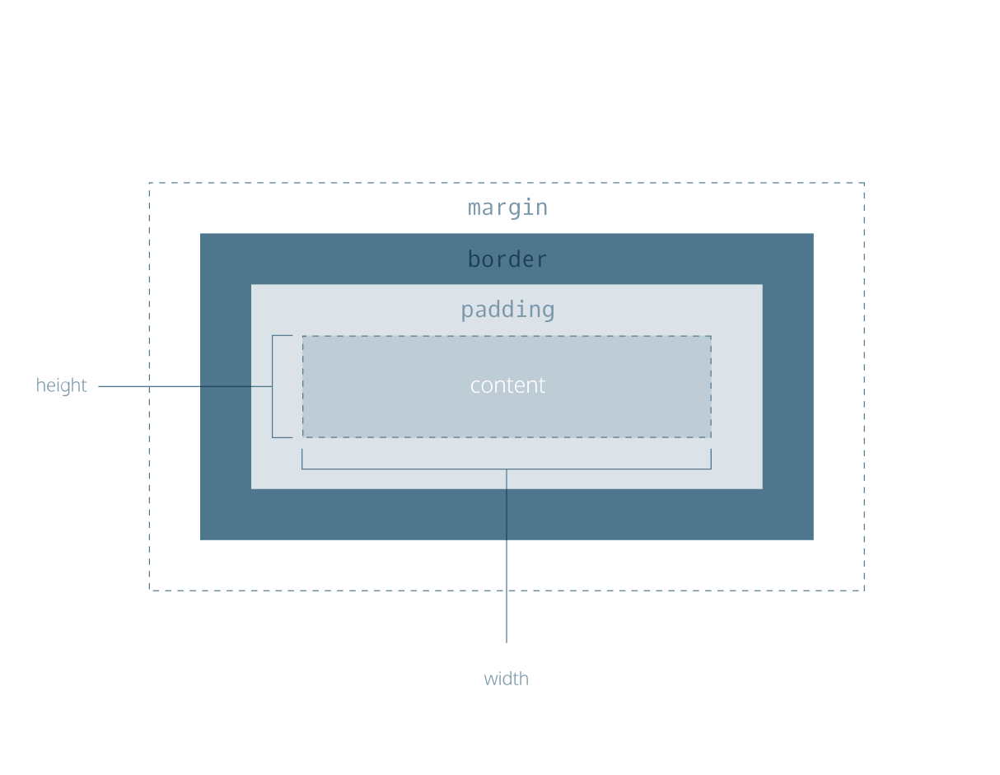

[Box Model cheatsheet](https://www.codecademy.com/resources/docs/css/box-model)

The CSS box model is a fundamental concept in web design that describes how HTML elements are structured and displayed in a browser. It consists of four areas: content, padding, border, and margin, which together define the size and spacing of elements on a webpage.

## CSS properties of note:
- width of content area
- height of content
- padding: space between content and border
- border: thickness and style of border
- margin: space between border and outside edge of element
- overflow

### Height and Width

By default set to hold raw contents of box

    p {
    height: 80px;
    width: 240px;
    }

### Borders

[CC Borders Cheatsheet](https://www.codecademy.com/resources/docs/css/borders)

Properties:
- width
    - thin
    - medium
    - thick
- style
    - none, dotted, solid, [etc](https://developer.mozilla.org/en-US/docs/Web/CSS/border-style#values)
- color
  - see [css-colors.md](./css-colors.md)
  
#### Border Examples:

    p {
    border: 3px solid coral;
    }

Default border style is 'medium none color' where color is current element color. If parameter not set, default value is used. ie

    p.content-header {
    height: 80px;
    width: 240px;
    border: solid coral;
    }

### Border Radius

Corners can be rounded by provided radius of a circle placed at each corner of default square box.

    div.container {
    border: 3px solid blue;
    border-radius: 5px;
    }

You can create a border that is a perfect circle by first creating an element with the same width and height, and then setting the radius equal to half the width of the box, which is 50%.

    div.container {
    height: 60px;
    width: 60px;
    border: 3px solid blue;
    border-radius: 50%;
    }

The code in the example above creates a \<div\> that is a perfect circle.

### Padding

Space between content and borders of box.

p.content-header {
  border: 3px solid coral;
  padding: 10px;
}

or adjust per side:
- padding-top
- padding-bottom
- padding-left
- padding-right

ie

    h2 {
    border: 1px dotted red;
    color: red;
    font-size: 14px;
    line-height: 48px;
    text-align: center;
    padding-top: 20px;
    padding-bottom: 20px;
    padding-right: 30px;
    padding-left: 30px;
    }

#### Padding Shorthand

You can specify these properties in a few different ways:
4 Values

    p.content-header {
    padding: 6px 11px 4px 9px;
    }

In the example above, the four values 6px 11px 4px 9px correspond to the amount of padding on each side, in a clockwise rotation. In order, it specifies the padding-top value (6px), the padding-right value (11px), the padding-bottom value (4px), and the padding-left value (9px) of the content.
3 Values

    p.content-header {
    padding: 5px 10px 20px;
    }

If the left and right sides of the content can be equal, the padding shorthand property allows for 3 values to be specified. The first value sets the padding-top value (5px), the second value sets the padding-left and padding-right values (10px), and the third value sets the padding-bottom value (20px).
2 Values

    p.content-header {
    padding: 5px 10px;
    }

And finally, if the top and bottom sides can be equal, and the left and right sides can be equal, you can specify 2 values. The first value sets the padding-top and padding-bottom values (5px), and the second value sets the padding-left and padding-right values (10px).